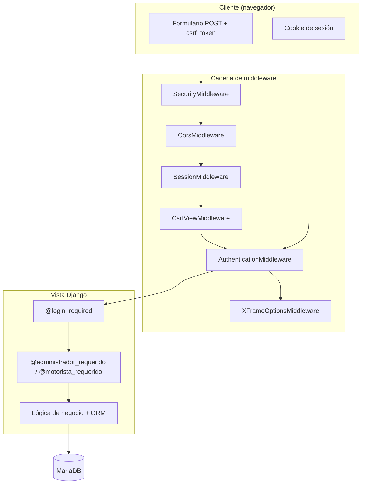
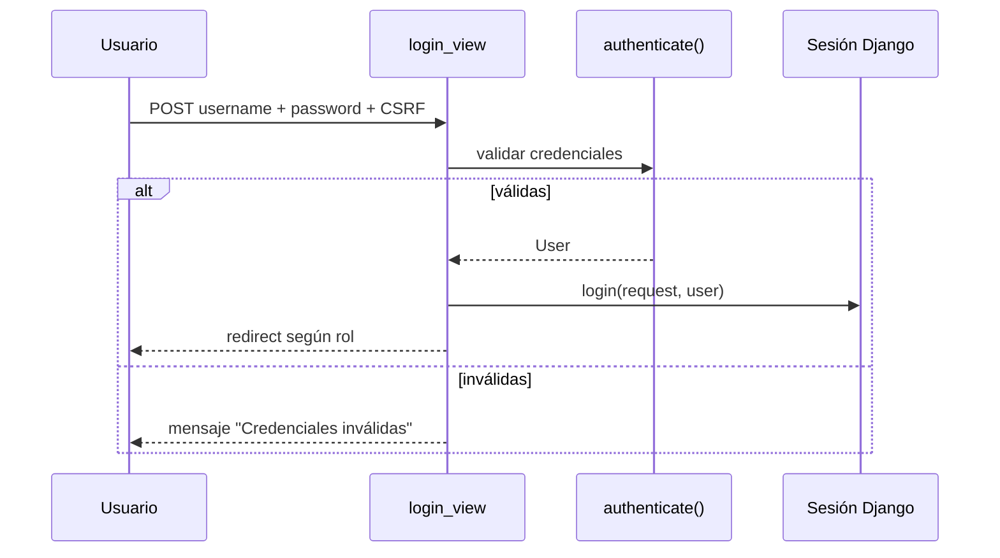
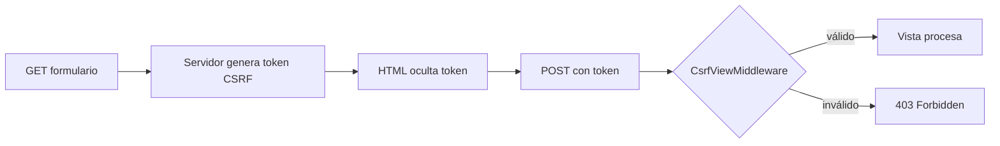
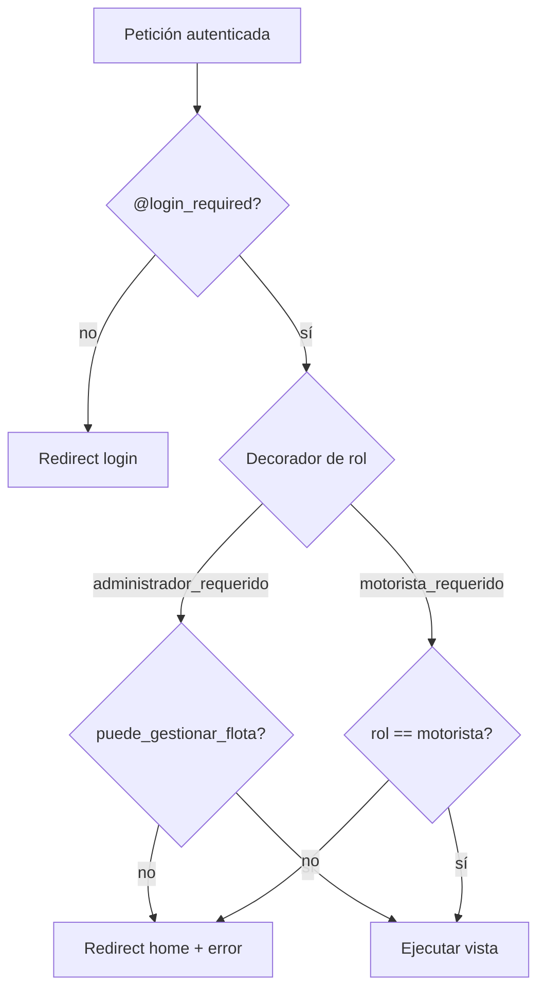
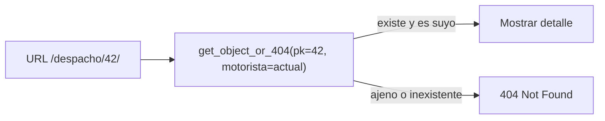
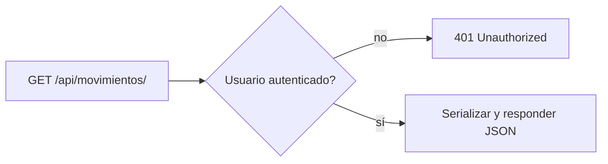

# Patrones de seguridad — Discopro Django

Documento de ejercicio académico. Cada patrón incluye una **imagen ilustrativa** (carpeta `docs/seguridad/img/`) y la **descripción de su aplicabilidad en el código fuente**.

---

## 1. Resumen ejecutivo

El proyecto aplica una estrategia de seguridad en capas típica de Django:

| Capa | Patrón principal | Ubicación |
|------|------------------|-----------|
| Transporte / HTTP | Middleware de seguridad, CSRF, X-Frame-Options | `discopro/settings.py` |
| Autenticación | Sesiones, `authenticate()` / `login()` | `apps/usuarios/views.py` |
| Autorización | Roles personalizados + decoradores | `apps/usuarios/permissions.py` |
| Datos | ORM parametrizado, unicidad, aislamiento por motorista | Modelos y `portal_views.py` |
| Contraseñas | Hashing, validadores, cambio seguro | Django Auth + `views.py` |
| API REST | `IsAuthenticated` global | `settings.py`, `apps/api/views.py` |
| UI | Menú condicional por rol, tokens CSRF en formularios | `templates/` |

### Índice de imágenes

| Figura | Archivo | Patrón | Código principal |
|--------|---------|--------|------------------|
| 1 | `01_arquitectura_capas.svg` | Defensa en capas | `discopro/settings.py` |
| 2 | `02_autenticacion_sesion.svg` | Sesión Django | `apps/usuarios/views.py` |
| 3 | `03_csrf.svg` | Token CSRF | `settings.py` + `templates/*.html` |
| 4 | `04_rbac_roles.svg` | RBAC por rol | `apps/usuarios/permissions.py` |
| 5 | `05_idor_motorista.svg` | Anti-IDOR | `apps/motoristas/portal_views.py` |
| 6 | `06_hash_contraseñas.svg` | Hash PBKDF2 | `forms.py` + `usuarios/views.py` |
| 7 | `07_orm_sql.svg` | ORM anti-SQLi | Modelos + vistas + `utils.py` |
| 8 | `08_api_rest.svg` | API autenticada | `apps/api/views.py` |

> **Cómo ver las imágenes:** Abre `DOCUMENTACION_SEGURIDAD.md` en VS Code (vista previa con `Ctrl+Shift+V`) o en GitHub. También puedes abrir cada `.svg` directamente en el navegador desde `docs/seguridad/img/`.

---

## 2. Arquitectura de seguridad (vista general)


*Figura 1 — Las cuatro capas de defensa: cliente → middleware → vistas → base de datos.*

**Aplicabilidad en código:** La cadena completa se define en `discopro/settings.py` (middleware) y se complementa con decoradores en cada vista.

```36:45:Discopro_Django/discopro/settings.py
MIDDLEWARE = [
    'django.middleware.security.SecurityMiddleware',
    'corsheaders.middleware.CorsMiddleware',
    'django.contrib.sessions.middleware.SessionMiddleware',
    'django.middleware.common.CommonMiddleware',
    'django.middleware.csrf.CsrfViewMiddleware',
    'django.contrib.auth.middleware.AuthenticationMiddleware',
    'django.contrib.messages.middleware.MessageMiddleware',
    'django.middleware.clickjacking.XFrameOptionsMiddleware',
]
```



**Aplicabilidad:** Toda petición HTTP pasa por la cadena definida en `MIDDLEWARE` antes de llegar a una vista. Los decoradores actúan como segunda barrera después de que `AuthenticationMiddleware` adjunta `request.user`.

---

## 3. Patrones identificados

### 3.1 Autenticación basada en sesión


*Figura 2 — El usuario autentica en `login_view`; Django crea una cookie de sesión y redirige según rol.*

**Patrón:** Session-based authentication (Django `contrib.auth`).

**Descripción:** El usuario envía credenciales; Django valida con `authenticate()` y crea una sesión con `login()`. Las vistas posteriores leen `request.user` gracias al middleware de autenticación.

**Flujo:**



**Código de referencia:**

```18:39:Discopro_Django/apps/usuarios/views.py
@require_http_methods(["GET", "POST"])
def login_view(request):
    if request.user.is_authenticated:
        return redirect(redireccion_por_rol(request.user))
    if request.method == 'POST':
        username = request.POST.get('username')
        password = request.POST.get('password')
        user = authenticate(request, username=username, password=password)
        if user is not None:
            login(request, user)
            ...
            return redirect(redireccion_por_rol(user))
```

**Aplicabilidad:** Punto de entrada único en `/usuarios/login/`. El cierre de sesión usa `logout()` en `logout_view`.

---

### 3.2 Protección CSRF (Cross-Site Request Forgery)


*Figura 3 — El template genera el token; el middleware lo valida antes de ejecutar la vista.*

**Patrón:** Token sincronizado por sesión (Synchronizer Token Pattern).

**Descripción:** `CsrfViewMiddleware` exige un token en peticiones POST que modifiquen estado. Los templates incluyen ``.

**Código en template (login):**

```124:125:Discopro_Django/templates/login.html
        <form method="POST" action="">
            
```

**Configuración:**

```36:45:Discopro_Django/discopro/settings.py
MIDDLEWARE = [
    'django.middleware.security.SecurityMiddleware',
    ...
    'django.middleware.csrf.CsrfViewMiddleware',
    ...
]
```

**Aplicabilidad:** Formularios de login, dashboard, CRUD de farmacias/motos/motoristas, portal motorista (incidencias), reportes, etc.



---

### 3.3 Control de acceso por roles (RBAC)


*Figura 4 — `obtener_rol()` determina el perfil; los decoradores bloquean rutas no autorizadas.*

**Patrón:** Role-Based Access Control con perfil extendido (`Usuario.rol`).

**Roles en el sistema:**

| Rol | Permisos principales |
|-----|----------------------|
| `administrador` / superuser | Acceso total + Django Admin |
| `despachador` | Gestión de flota y movimientos |
| `operador` | Solo movimientos y exportación (sin flota) |
| `motorista` | Portal exclusivo `/portal-motorista/` |

**Implementación central:**

```9:37:Discopro_Django/apps/usuarios/permissions.py
def obtener_rol(user):
    if not user.is_authenticated:
        return None
    if user.is_superuser:
        return 'administrador'
    try:
        return user.usuario_profile.rol
    except Usuario.DoesNotExist:
        return None

def puede_gestionar_flota(user):
    rol = obtener_rol(user)
    return user.is_superuser or rol in ('administrador', 'despachador')

def administrador_requerido(view_func):
  ...
```

**Diagrama de autorización:**



**Aplicabilidad:**
- `@administrador_requerido` en `apps/motoristas/views.py` (farmacias, motos, motoristas) y edición de movimientos.
- `@motorista_requerido` en `apps/motoristas/portal_views.py`.
- `redireccion_por_rol()` envía motoristas al portal tras login.

---

### 3.4 Decorador de autenticación (`@login_required`)

**Patrón:** Declarative access control a nivel de vista.

**Descripción:** Impide el acceso anónimo; redirige a `usuarios:login`.

**Aplicabilidad:** `home`, movimientos, reportes, perfil, portal motorista, logout, cambio de contraseña, etc.

```27:28:Discopro_Django/apps/motoristas/portal_views.py
@login_required(login_url='usuarios:login')
@motorista_requerido
```

---

### 3.5 Aislamiento de datos del motorista (prevención IDOR)


*Figura 5 — Comparación entre consulta vulnerable y la implementación segura con filtro `motorista=motorista`.*

**Patrón:** Object-level authorization — filtrar por propietario del recurso.

**Descripción:** En el portal, un motorista solo accede a movimientos donde `motorista=request.user` (vía relación `Motorista`). `get_object_or_404` combina `pk` + `motorista=motorista`, evitando acceso a despachos ajenos aunque se adivine el ID.

```50:55:Discopro_Django/apps/motoristas/portal_views.py
def detalle_despacho(request, pk):
    motorista = _motorista_actual(request)
    despacho = get_object_or_404(Movimiento.objects.select_related('sucursal'), pk=pk, motorista=motorista)
```



**Aplicabilidad:** `detalle_despacho`, `iniciar_ruta`, `marcar_entregado`, `reportar_incidencia`.

---

### 3.6 Hashing y política de contraseñas


*Figura 6 — La contraseña nunca se almacena en texto plano; `create_user` y `set_password` aplican PBKDF2.*

**Patrón:** Password hashing (PBKDF2 por defecto en Django) + validadores configurados.

**Creación segura de usuarios:**

```326:332:Discopro_Django/apps/motoristas/forms.py
user = User.objects.create_user(
    username=self.cleaned_data['username'],
    ...
    password=self.cleaned_data['password'],
)
```

`create_user` hashea la contraseña; nunca se almacena en texto plano.

**Cambio de contraseña con verificación:**

```74:83:Discopro_Django/apps/usuarios/views.py
if not request.user.check_password(contraseña_actual):
    messages.error(request, 'Contraseña actual incorrecta')
...
request.user.set_password(contraseña_nueva)
request.user.save()
```

**Validadores globales** (`AUTH_PASSWORD_VALIDATORS`): similitud con atributos del usuario, longitud mínima, contraseñas comunes, no solo numéricas.

---

### 3.7 Protección contra inyección SQL


*Figura 7 — El proyecto usa exclusivamente el ORM de Django; no concatena SQL manualmente.*

**Patrón:** ORM parametrizado (Prepared Statements implícitos).

**Descripción:** Las consultas usan el ORM de Django (`filter`, `get`, `create`), que parametriza valores SQL. No hay concatenación manual de SQL en vistas.

**Ejemplo:**

```166:179:Discopro_Django/discopro/urls.py
motorista = Motorista.objects.select_related('sucursal').filter(pk=motorista_id, activo=True).first()
...
Movimiento.objects.create(
    numero_despacho=numero_despacho,
    direccion_destino=direccion_destino,
    motorista=motorista,
    sucursal=motorista.sucursal,
)
```

**Aplicabilidad:** Todo el acceso a datos en vistas, formularios y API.

---

### 3.8 Integridad y unicidad en base de datos

**Patrón:** Unique constraints a nivel de modelo.

**Campos con `unique=True`:**

| Modelo | Campo | Propósito |
|--------|-------|-----------|
| `Sucursal` | `nombre` | Evitar farmacias duplicadas |
| `Moto` | `placa` | Identificador único de vehículo |
| `Motorista` | `licencia` | Licencia única |
| `Usuario` | `rut` | Identidad única |
| `Movimiento` | `numero_despacho` | Código de despacho único |

**Validación adicional en aplicación:** comprobación antes de crear movimiento (`numero_despacho` ya existe).

---

### 3.9 Seguridad en capa de presentación (UI)

**Patrón:** Least privilege en interfaz — ocultar navegación según rol.

**Descripción:** El context processor `permisos_usuario` expone `user_rol`, `es_operador` y `puede_gestionar_flota` a todos los templates. `base.html` muestra menús distintos para motoristas vs. personal administrativo.

```1:10:Discopro_Django/apps/usuarios/context_processors.py
def permisos_usuario(request):
    user = request.user
    return {
        'user_rol': obtener_rol(user) if user.is_authenticated else None,
        'es_operador': es_operador(user) if user.is_authenticated else False,
        'puede_gestionar_flota': puede_gestionar_flota(user) if user.is_authenticated else False,
    }
```

**Nota:** La UI complementa pero **no sustituye** la autorización en servidor (defensa en profundidad).

---

### 3.10 API REST — autenticación obligatoria


*Figura 8 — Sin sesión válida la API responde 401; con autenticación devuelve los datos.*

**Patrón:** Default deny — solo usuarios autenticados.

```118:120:Discopro_Django/discopro/settings.py
'DEFAULT_PERMISSION_CLASSES': [
    'rest_framework.permissions.IsAuthenticated',
],
```

Cada ViewSet repite `permission_classes = [permissions.IsAuthenticated]`.

**Aplicabilidad:** Endpoints bajo `/api/` (usuarios, motoristas, movimientos, sucursales, reportes).



---

### 3.11 Middleware de seguridad HTTP

| Middleware | Función |
|------------|---------|
| `SecurityMiddleware` | Cabeceras de seguridad (HSTS si está configurado, etc.) |
| `XFrameOptionsMiddleware` | Mitiga clickjacking (`X-Frame-Options`) |
| `CorsMiddleware` | Restringe orígenes CORS a localhost |

**CORS permitido:**

```124:128:Discopro_Django/discopro/settings.py
CORS_ALLOWED_ORIGINS = [
    "http://localhost:3000",
    "http://localhost:8000",
    "http://127.0.0.1:8000",
]
```

---

### 3.12 Restricción de métodos HTTP

**Patrón:** Allowlist de verbos HTTP en vistas sensibles.

```18:18:Discopro_Django/apps/usuarios/views.py
@require_http_methods(["GET", "POST"])
```

Evita que métodos no previstos (p. ej. `DELETE` en login) ejecuten la vista.

---

### 3.13 Gestión de secretos y configuración

**Patrón:** Externalized configuration con `python-decouple`.

```14:16:Discopro_Django/discopro/settings.py
SECRET_KEY = config('SECRET_KEY', default='django-insecure-your-secret-key-change-in-production')
DEBUG = config('DEBUG', default=True, cast=bool)
```

Credenciales de BD también vía variables de entorno (`DB_NAME`, `DB_USER`, etc.).

---

### 3.14 Auditoría y trazabilidad (logging)

**Patrón:** Registro centralizado en archivo.

```131:145:Discopro_Django/discopro/settings.py
LOGGING = {
    ...
    'handlers': {
        'file': {
            'level': 'INFO',
            'class': 'logging.FileHandler',
            'filename': BASE_DIR / 'logs' / 'discopro.log',
        },
    },
}
```

**Aplicabilidad:** Eventos del sistema registrados en `logs/discopro.log` para análisis posterior.

---

### 3.15 Validación de entrada en formularios

**Patrón:** Server-side validation con Django Forms.

**Ejemplos en `MotoristaCrearForm`:**
- `clean_rut`: unicidad de RUT
- `clean_username`: unicidad de nombre de usuario
- Campos obligatorios y tipos validados antes de persistir

**Aplicabilidad:** Alta en CRUD administrativo; reduce datos inválidos y duplicados.

---

### 3.16 Validación de entidades activas

**Patrón:** Business rule validation — solo motoristas activos con farmacia asignada.

```166:172:Discopro_Django/discopro/urls.py
motorista = Motorista.objects.select_related('sucursal').filter(pk=motorista_id, activo=True).first()
if motorista is None:
    messages.error(request, 'Seleccione un motorista válido.')
if motorista.sucursal is None:
    messages.error(request, 'El motorista seleccionado no tiene farmacia asignada.')
```

Evita asignar despachos a recursos deshabilitados o incompletos.

---

## 4. Matriz patrón ↔ archivo

| Patrón | Archivos principales |
|--------|---------------------|
| Sesión / login | `apps/usuarios/views.py`, `templates/login.html` |
| CSRF | `discopro/settings.py`, todos los formularios HTML |
| RBAC | `apps/usuarios/permissions.py`, `apps/usuarios/models.py` |
| Portal motorista | `apps/motoristas/portal_views.py`, `portal_urls.py` |
| Flota admin | `apps/motoristas/views.py` |
| Movimientos | `discopro/urls.py`, `apps/movimientos/views.py` |
| API | `apps/api/views.py`, `apps/api/serializers.py` |
| Contraseñas | `settings.py`, `forms.py`, `usuarios/views.py` |
| UI por rol | `templates/base.html`, `context_processors.py` |

---

## 5. Observaciones (áreas de mejora potencial)

Documentadas con fines académicos; **no implican cambios en este ejercicio:**

1. **`ALLOWED_HOSTS = ['*']`** — conveniente en desarrollo; en producción conviene lista explícita de dominios.
2. **API sin RBAC granular** — cualquier usuario autenticado puede acceder a todos los ViewSets; no hay filtro por rol como en las vistas HTML.
3. **Detalle de movimiento administrativo** — `detalle_movimiento` no restringe por rol; cualquier usuario logueado puede ver cualquier movimiento por `pk`.
4. **`DEBUG=True` por defecto** — debe desactivarse en producción.
5. **Secreto por defecto en código** — el `SECRET_KEY` fallback debe reemplazarse en despliegue real.

---

## 6. Conclusión

Discopro implementa un modelo de seguridad coherente con las buenas prácticas de Django: autenticación por sesión, CSRF, autorización por roles, hashing de contraseñas, ORM anti-inyección, y aislamiento de datos en el portal del motorista. La defensa se organiza en **middleware → decoradores → reglas de negocio → restricciones de BD**, con una capa adicional de **presentación condicional** según el rol del usuario.

---

