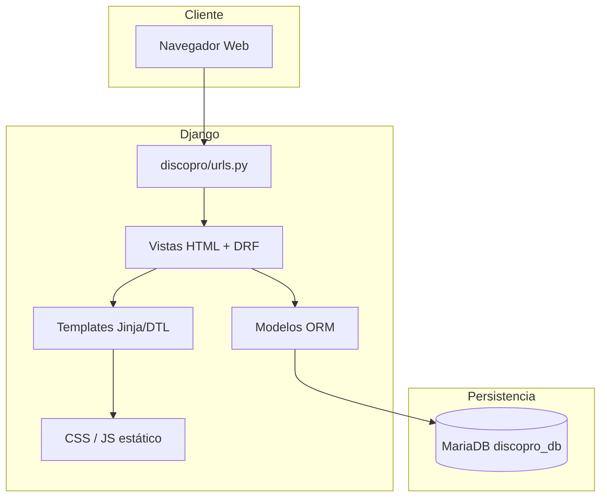
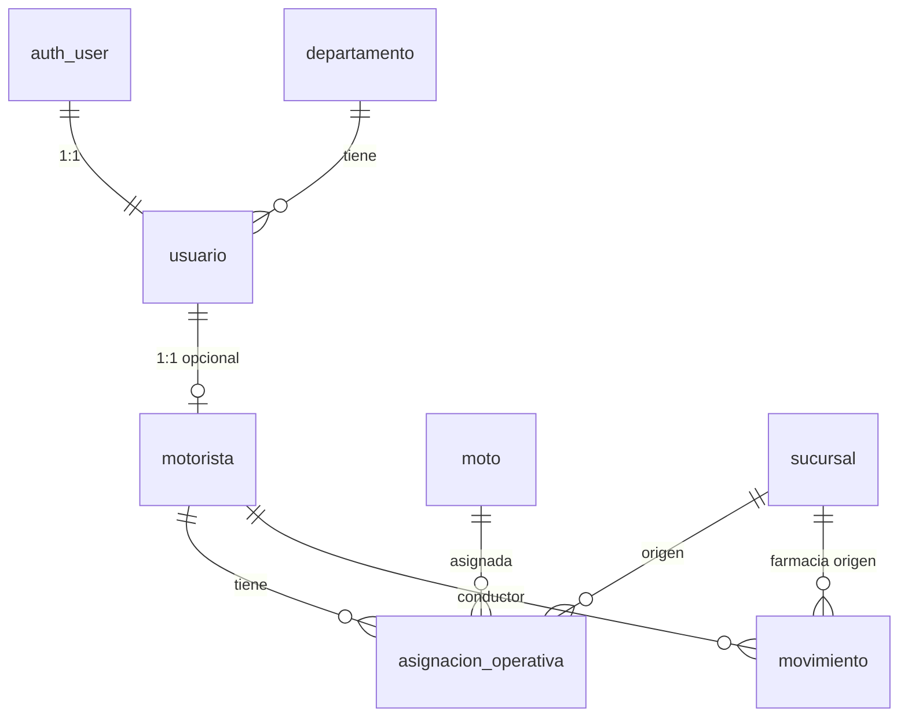
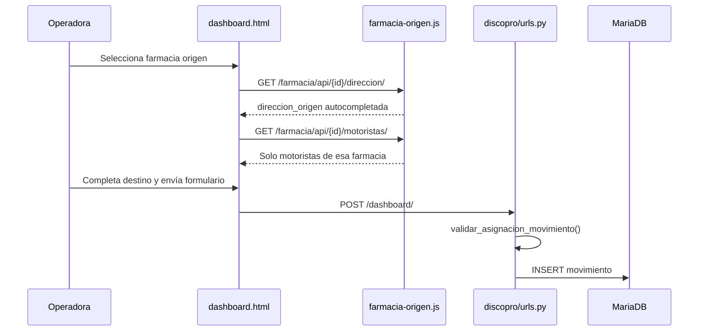

# Documentación Técnica Integral — LogiPro / Discopro Django

**Cliente:** Discopro Ltda.  
**Sistema:** LogiPro — Plataforma logística de despachos farmacéuticos  
**Stack:** Python 3.x · Django 6.0.5 · MariaDB/MySQL · Django REST Framework · Templates HTML  
**Ruta del proyecto:** `Discopro_Django/`  
**Fecha:** 4 de julio de 2026

---

## Tabla de contenidos

1. [Visión general](#1-visión-general)
2. [Arquitectura del sistema](#2-arquitectura-del-sistema)
3. [Base de datos funcional](#3-base-de-datos-funcional)
4. [Modelo de datos (código)](#4-modelo-de-datos-código)
5. [Capa de negocio y validaciones](#5-capa-de-negocio-y-validaciones)
6. [Mapa de páginas web (UI)](#6-mapa-de-páginas-web-ui)
7. [API REST](#7-api-rest)
8. [Autenticación, roles y permisos](#8-autenticación-roles-y-permisos)
9. [Flujos operativos](#9-flujos-operativos)
10. [Archivos estáticos y JavaScript](#10-archivos-estáticos-y-javascript)
11. [Despliegue local y datos de prueba](#11-despliegue-local-y-datos-de-prueba)
12. [Inventario de archivos fuente](#12-inventario-de-archivos-fuente)

---

## 1. Visión general

LogiPro es una aplicación web monolítica Django que centraliza la operación logística de despachos desde **farmacias de origen** (puntos físicos sin acceso al sistema) hacia direcciones de entrega, asignando **motoristas** de la flota de Discopro.

### Actores del sistema

| Actor | Rol en BD | Acceso |
|-------|-----------|--------|
| Administrador del sistema | `administrador` | Todo + gestión de usuarios |
| Supervisor / Gerencia | `supervisor` | Farmacias, motos, motoristas, movimientos |
| Operadora | `operador` | Registro de despachos, exportación |
| Motorista | `motorista` | Portal propio (despachos asignados) |
| Farmacia (Cruz Verde u otras) | — | **Sin acceso** — solo datos operativos |

### Principios arquitectónicos implementados

- **Credenciales separadas de datos operativos:** `auth.User` + `Usuario` para login; `Motorista` solo datos de licencia y geografía.
- **Asignaciones intermedias:** tabla `AsignacionOperativa` vincula moto + farmacia a motorista.
- **Farmacia de origen:** movimientos cargan dirección de origen automáticamente desde BD.
- **Restricción geográfica-operativa:** motorista solo puede tomar despachos de su farmacia asignada.

---

## 2. Arquitectura del sistema



### Aplicaciones Django (`INSTALLED_APPS`)

| App | Responsabilidad |
|-----|-----------------|
| `apps.usuarios` | Login, perfiles, roles, administración de usuarios |
| `apps.motoristas` | Farmacias, motos, motoristas, asignaciones, portal |
| `apps.movimientos` | Despachos / movimientos logísticos |
| `apps.reportes` | Generación de reportes |
| `apps.api` | API REST (DRF ViewSets) |

### Configuración de base de datos

```python
# discopro/settings.py
DATABASES = {
    'default': {
        'ENGINE': 'django.db.backends.mysql',
        'NAME': config('DB_NAME', default='discopro_db'),
        'USER': config('DB_USER', default='root'),
        'PASSWORD': config('DB_PASSWORD', default='admin123'),
        'HOST': config('DB_HOST', default='localhost'),
        'PORT': config('DB_PORT', default='3306'),
        'CHARSET': 'utf8mb4',
    }
}
```

---

## 3. Base de datos funcional

### Diagrama entidad-relación (simplificado)



### Tablas principales

#### `departamento`

| Campo | Tipo | Descripción |
|-------|------|-------------|
| id | BIGINT PK | Identificador |
| nombre | VARCHAR(100) UNIQUE | Nombre del departamento |
| tipo | ENUM | admin / supervision / operacion |
| descripcion | TEXT | Descripción |
| creado_en, actualizado_en | DATETIME | Auditoría |

#### `usuario` (perfil extendido)

| Campo | Tipo | Descripción |
|-------|------|-------------|
| id | BIGINT PK | |
| user_id | FK → auth_user | Credenciales Django |
| rut | VARCHAR(12) UNIQUE | RUT chileno (no usado en login actual) |
| telefono | VARCHAR(15) | Contacto |
| rol | VARCHAR(20) | administrador / supervisor / operador / motorista |
| departamento_id | FK nullable | |
| estado | BOOLEAN | Activo/inactivo |
| ultimo_login | DATETIME nullable | |

#### `sucursal_flota` (Farmacia origen)

| Campo | Tipo | Descripción |
|-------|------|-------------|
| nombre | VARCHAR(100) UNIQUE | Nombre comercial |
| region | VARCHAR(100) | Ej: Arica, Parinacota, O'Higgins |
| provincia | VARCHAR(100) | |
| comuna | VARCHAR(100) | |
| direccion | VARCHAR(255) | Calle / referencia |
| telefono | VARCHAR(20) | |
| encargado_nombre | VARCHAR(120) | Solo referencia textual |
| activo | BOOLEAN | |

#### `moto`

| Campo | Tipo | Descripción |
|-------|------|-------------|
| placa | VARCHAR(20) UNIQUE | |
| marca, modelo | VARCHAR | |
| año | INT | |
| color | VARCHAR(30) | |
| estado | ENUM | disponible / en_mantenimiento / dañada / retirada |
| activo | BOOLEAN | |

#### `motorista`

| Campo | Tipo | Descripción |
|-------|------|-------------|
| usuario_id | FK UNIQUE → usuario | Perfil vinculado |
| licencia | VARCHAR(20) UNIQUE | |
| tipo_licencia | VARCHAR(5) | |
| vigencia_licencia | DATE | |
| region, provincia, comuna, direccion | VARCHAR | Geografía personal |
| estado | ENUM | disponible / en_ruta / inactivo / bloqueado |
| activo | BOOLEAN | |

#### `asignacion_operativa`

| Campo | Tipo | Descripción |
|-------|------|-------------|
| motorista_id | FK | |
| moto_id | FK nullable | |
| sucursal_id | FK PROTECT | Farmacia origen asignada |
| activa | BOOLEAN | Solo una activa por motorista (lógica app) |
| observaciones | TEXT | |

#### `movimiento`

| Campo | Tipo | Descripción |
|-------|------|-------------|
| numero_despacho | VARCHAR(50) UNIQUE | Código/folio del despacho |
| sucursal_id | FK PROTECT | Farmacia de origen |
| direccion_origen | VARCHAR(255) | Autocompletada desde farmacia |
| direccion_destino | VARCHAR(255) | Punto de entrega |
| motorista_id | FK nullable | |
| estado | ENUM | pendiente / en_ruta / entregado / incidencia |
| tipo_incidencia | VARCHAR(30) | |
| comentario_incidencia | TEXT | |
| entregado_en | DATETIME nullable | |
| creado_en, actualizado_en | DATETIME | |

### Migraciones aplicadas (orden)

```
usuarios:     0001 → 0002 → 0003_arquitectura_logistica
motoristas:   0001 → ... → 0006_corregir_regiones
movimientos:  0001 → ... → 0007_arquitectura_logistica
reportes:     0001_initial
```

---

## 4. Modelo de datos (código)

### Usuario del sistema

```python
# apps/usuarios/models.py
class Usuario(models.Model):
    ROLES = [
        ('administrador', 'Administrador del sistema'),
        ('supervisor', 'Supervisor / Gerencia'),
        ('operador', 'Operadora'),
        ('motorista', 'Motorista'),
    ]
    user = models.OneToOneField(User, on_delete=models.CASCADE, related_name='usuario_profile')
    rut = models.CharField(max_length=12, unique=True)
    rol = models.CharField(max_length=20, choices=ROLES, default='operador')
    # ...
```

### Asignación operativa y sincronización

```python
# apps/motoristas/models.py
class AsignacionOperativa(models.Model):
    motorista = models.ForeignKey(Motorista, related_name='asignaciones', ...)
    moto = models.ForeignKey(Moto, null=True, blank=True, ...)
    sucursal = models.ForeignKey(Sucursal, on_delete=models.PROTECT, ...)
    activa = models.BooleanField(default=True)

def sincronizar_asignacion(motorista, moto, sucursal, observaciones=''):
    AsignacionOperativa.objects.filter(motorista=motorista, activa=True).update(activa=False)
    return AsignacionOperativa.objects.create(...)
```

### Movimiento con autocompletado de origen

```python
# apps/movimientos/models.py
class Movimiento(models.Model):
    numero_despacho = models.CharField(max_length=50, unique=True)
    sucursal = models.ForeignKey(Sucursal, verbose_name='Farmacia origen', ...)
    direccion_origen = models.CharField(max_length=255, blank=True, default='')
    direccion_destino = models.CharField(max_length=255, default='')
    estado = models.CharField(choices=ESTADOS, default='pendiente')

    def save(self, *args, **kwargs):
        if self.sucursal_id and not self.direccion_origen:
            self.direccion_origen = self.sucursal.direccion_completa or self.sucursal.direccion
        super().save(*args, **kwargs)
```

---

## 5. Capa de negocio y validaciones

### Validación motorista ↔ farmacia

```python
# apps/movimientos/utils.py
def motorista_pertenece_a_farmacia(motorista, sucursal):
    return motorista.asignaciones.filter(activa=True, sucursal_id=sucursal.pk).exists()

def validar_asignacion_movimiento(motorista, sucursal):
    if not motorista_pertenece_a_farmacia(motorista, sucursal):
        return f'El motorista ... no puede operar despachos de "{sucursal.nombre}".'
    return None
```

**Punto de aplicación:** registro de despacho en dashboard (`discopro/urls.py`) y edición de movimiento (`apps/movimientos/views.py`).

### Geografía en cascada

```python
# apps/motoristas/geografia.py
GEOGRAFIA_CHILE = {
    'Arica': {'Arica': ['Arica']},
    'Parinacota': {'Parinacota': ['Putre', 'General Lagos']},
    "O'Higgins": {'Cachapoal': ['Rancagua', ...]},
    # ...
}
```

APIs: `GET /farmacia/api/provincias/?region=...` · `GET /farmacia/api/comunas/?region=...&provincia=...`

### Permisos por rol

```python
# apps/usuarios/permissions.py
def puede_gestionar_flota(user):
    return rol in ('administrador', 'supervisor')

def es_administrador_sistema(user):
    return user.is_superuser or rol == 'administrador'
```

---

## 6. Mapa de páginas web (UI)

### Rutas públicas

| URL | Template | Descripción |
|-----|----------|-------------|
| `/` | redirect | Redirige a login |
| `/usuarios/login/` | `login.html` | Pantalla LogiPro — usuario + contraseña |

### Panel operativo (autenticado)

| URL | Template | Roles |
|-----|----------|-------|
| `/dashboard/` | `dashboard.html` | Todos excepto motorista |
| `/farmacia/` | `sucursales.html` | Admin, supervisor |
| `/farmacia/crear/` | `sucursal_crear.html` | Admin, supervisor |
| `/farmacia/<id>/editar/` | `sucursal_editar.html` | Admin, supervisor |
| `/motoristas/` | `motoristas.html` | Admin, supervisor |
| `/motoristas/crear/` | `motorista_crear.html` | Admin, supervisor |
| `/motoristas/motos/` | `motos.html` | Admin, supervisor |
| `/movimientos/<id>/` | `movimiento_detalle.html` | Autenticado |
| `/movimientos/<id>/editar/` | `movimiento_editar.html` | Admin, supervisor |
| `/usuarios/administracion/` | `usuarios/lista_usuarios.html` | Solo administrador |

### Portal motorista

| URL | Template | Acción |
|-----|----------|--------|
| `/portal-motorista/` | `motorista_portal/inicio.html` | Resumen y accesos rápidos |
| `/portal-motorista/mis-despachos/` | `mis_despachos.html` | Lista activa |
| `/portal-motorista/despacho/<id>/` | `detalle_despacho.html` | Detalle + Maps |
| `/portal-motorista/despacho/<id>/iniciar-ruta/` | — | Cambia estado → `en_ruta` |
| `/portal-motorista/despacho/<id>/entregado/` | — | Cambia estado → `entregado` |
| `/portal-motorista/despacho/<id>/incidencia/` | `incidencia.html` | Reporte de problema |

### Layout base

- **`templates/base.html`:** sidebar, menú por rol, branding Discopro Logística / LogiPro en login.
- **Context processor:** `apps/usuarios/context_processors.permisos_usuario` inyecta `user_rol`, `puede_gestionar_flota`, etc.

---

## 7. API REST

**Base:** `/api/` · Autenticación: sesión Django / DRF `IsAuthenticated`

| Endpoint | ViewSet | Recurso |
|----------|---------|---------|
| `/api/departamentos/` | DepartamentoViewSet | Departamentos |
| `/api/usuarios/` | UsuarioViewSet | Perfiles |
| `/api/motoristas/` | MotoristaViewSet | Motoristas + asignaciones |
| `/api/sucursales/` | SucursalViewSet | Farmacias |
| `/api/movimientos/` | MovimientoViewSet | Despachos |

### APIs auxiliares (HTML app)

| Método | URL | Respuesta |
|--------|-----|-----------|
| GET | `/farmacia/api/<id>/direccion/` | JSON `{direccion, nombre}` |
| GET | `/farmacia/api/<id>/motoristas/` | JSON `{motoristas: [{id, nombre, moto}]}` |
| GET | `/farmacia/api/provincias/?region=X` | JSON `{provincias: [...]}` |
| GET | `/farmacia/api/comunas/?region=X&provincia=Y` | JSON `{comunas: [...]}` |

---

## 8. Autenticación, roles y permisos

### Flujo de login (código actual)

```python
# apps/usuarios/views.py — login_view
username = request.POST.get('username')
password = request.POST.get('password')
user = authenticate(request, username=username, password=password)
if user is not None:
    login(request, user)
    return redirect(redireccion_por_rol(user))
```

### Redirección post-login

- **Motorista** → `/portal-motorista/`
- **Resto** → `/dashboard/`

### Matriz de acceso resumida

| Funcionalidad | Admin | Supervisor | Operador | Motorista |
|---------------|:-----:|:----------:|:--------:|:---------:|
| Dashboard despachos | ✓ | ✓ | ✓ | — |
| CRUD farmacias/motos/motoristas | ✓ | ✓ | — | — |
| Admin usuarios | ✓ | — | — | — |
| Portal motorista | — | — | — | ✓ |

---

## 9. Flujos operativos

### Flujo 1 — Registrar despacho (operadora)



### Flujo 2 — Motorista en ruta

1. Motorista ve despacho `pendiente` en portal.
2. Acción **Iniciar ruta** → `estado = en_ruta`.
3. **Marcar entregado** → `estado = entregado`, `entregado_en = now()`.
4. Alternativa: **Reportar incidencia** → `estado = incidencia` + tipo + comentario.

### Estados del dominio vs nomenclatura RF5

| Especificación RF5 | Implementación LogiPro |
|--------------------|------------------------|
| Libre | `Motorista.estado = disponible` |
| Trayecto | `Movimiento.estado = en_ruta` |
| En Punto | *No modelado explícitamente* |

---

## 10. Archivos estáticos y JavaScript

| Archivo | Función |
|---------|---------|
| `static/css/style.css` | Estilos globales, responsive, badges de estado |
| `static/js/app.js` | Menú móvil, alertas, confirmaciones |
| `static/js/geografia.js` | Cascada región → provincia → comuna |
| `static/js/farmacia-origen.js` | Dirección automática + filtro motoristas por farmacia |

---

## 11. Despliegue local y datos de prueba

### Requisitos

- Python 3.10+
- MariaDB/MySQL
- Variables en `.env` (ver `.env.example`)

### Comandos

```powershell
cd Discopro_Django
pip install -r requirements.txt
py manage.py migrate
py seed_arica_parinacota.py
py manage.py runserver
```

### Usuarios de prueba

| Usuario | Contraseña | Rol |
|---------|------------|-----|
| admin_arica | AdminArica123 | Administrador |
| despacho_arica | DespachoArica123 | Supervisor |
| operador_arica | OperadorArica123 | Operador |
| motorista_vega | Motorista123 | Motorista |

Documentación ampliada: `README_DATOS_PRUEBA.md`

### Ejecutar pruebas

```powershell
py manage.py test --verbosity=2
```

Resultados documentados en: `RESULTADOS_EVIDENCIAS_PRUEBAS_SOFTWARE.md`

---

## 12. Inventario de archivos fuente

### Backend Python

```
apps/
├── usuarios/
│   ├── models.py          # Usuario, Departamento
│   ├── views.py           # Login, admin usuarios
│   ├── forms.py           # UsuarioSistemaForm
│   ├── permissions.py     # Decoradores de rol
│   └── context_processors.py
├── motoristas/
│   ├── models.py          # Sucursal, Moto, Motorista, AsignacionOperativa
│   ├── views.py           # CRUD + APIs geografía/motoristas
│   ├── portal_views.py    # Portal motorista
│   ├── forms.py           # GeografiaFormMixin, SucursalForm, MotoristaForm
│   ├── geografia.py       # Datos Chile
│   ├── farmacia_urls.py
│   └── urls.py
├── movimientos/
│   ├── models.py          # Movimiento
│   ├── views.py           # Detalle, editar, exportar Excel
│   └── utils.py           # Filtros + validación asignación
├── reportes/
│   └── views.py
└── api/
    ├── views.py           # DRF ViewSets
    └── serializers.py
discopro/
├── settings.py
├── urls.py                # Dashboard + rutas raíz
└── wsgi.py
tests.py                   # Suite unittest (requiere actualización)
seed_arica_parinacota.py   # Datos demo Arica/Parinacota
```

### Frontend Templates

```
templates/
├── base.html
├── login.html
├── dashboard.html
├── sucursales.html, sucursal_crear.html, sucursal_editar.html
├── motoristas.html, motorista_crear.html, motorista_editar.html, motorista_detalle.html
├── motos.html, moto_crear.html, moto_editar.html
├── movimiento_detalle.html, movimiento_editar.html
├── usuarios/lista_usuarios.html, usuario_form.html
└── motorista_portal/
    ├── inicio.html, mis_despachos.html, detalle_despacho.html
    ├── incidencia.html, historial.html, perfil.html, mi_moto.html
```

### Documentación complementaria existente

| Archivo | Contenido |
|---------|-----------|
| `DOCUMENTACION_SEGURIDAD.md` | Análisis de seguridad general |
| `DOCUMENTACION_SEGURIDAD_CODIGO.md` | Seguridad con referencias a código |
| `evaluacion.md` | Autoevaluación del proyecto |
| `PLAN_MANTENCION.md` | Plan de mantención |
| `API_DOCUMENTATION.md` | Endpoints REST |
| `RESULTADOS_EVIDENCIAS_PRUEBAS_SOFTWARE.md` | Reporte QA (este ciclo) |

---

## Apéndice — Brecha respecto a requerimientos Cruz Verde / LogiPro

Funcionalidades **pendientes de implementar** respecto a la especificación original de pruebas:

| Requerimiento | Estado en código |
|---------------|------------------|
| Login con RUT | Username Django |
| Bloqueo 3 intentos | No existe |
| Folio numérico 8–10 dígitos | CharField libre |
| Duplicidad solo mismo día | Unicidad permanente |
| Estados Libre/Trayecto/En Punto | Nomenclatura distinta |
| Filtro PII Ley 19.628 | No existe |
| Locking concurrente RNF13 | No existe |

---

*Documento técnico de referencia para defensa de proyecto de ingeniería — Discopro Ltda. / LogiPro.*
